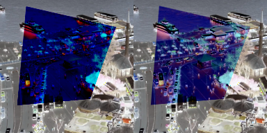

## Image Registration

In this work we use Deep Learning to perform multi-modal image registration.

Image Registration is the process of finding motion parameters between two images. 
Those parameters will then be used to warp one image to the other.

Image Registration is a very important step in many medical imaging applications.
For example, in the case of PET/CT, the PET image is registered to the CT image.
This is done to align the two images and to be able to perform quantitative analysis
on the PET image.

In this work, we use a Deep Learning approach to perform image registration.
Our goal is to register Infra-Red (IR) images to RGB images.

### Dataset
We generate our dataset using SkyData dataset. we generate 28000 pairs of images for training and 8000 pairs for testing.
we use the following random transformations on the images and annonate the transformation parameters which will be used
during the training phase to evaluate models performance.

## Environment

1. Conda
```bash
curl https://repo.anaconda.com/miniconda/Miniconda3-latest-Linux-x86_64.sh -o Miniconda3-latest-Linux-x86_64.sh
bash Miniconda3-latest-Linux-x86_64.sh
```

2. create environment
```bash
cd ImageRegistration566/
conda env create -f environment.yaml
```

3. training

```bash
cd model/
#you can change the parameters in the train.sh
bash train.sh
```

4. inference

inference is run on the test set, and the results are saved in the results folder model/results folder as a csv file.
```bash
cd model/
#you can provide arguments for which model to use when running test.py 
python test.py 
```
## Results

|       | count | mean    | std     | min    | 25%    | 50%     | 75%    | max       |
| ----- | ---- | ------- | ------- | ------ | ------ | ------- | ------ | --------- |
| dhn   | 7990 | 155.39  | 249.79  | 57.04  | 136.21 | 143.51  | 151.11 | 12720.9   |
| clkn  | 7990 | 194.58  | 7550.3  | 3.03   | 26.76  | 36.71   | 51.17  | 605127.75 |
| dlkfm | 7990 | 19.82   | 78.87   | **0.29**   | **1.58**   | **4.34**    | 28.04  | 4510.84   |
| mhn   | 7990 | 173.51  | 395.8   | 80.19  | 150.22 | 160.52  | 170.45 | 33016.71  |
| Sift  | 7990 | 1104.43 | 6702.82 | **2.16**   | 220.59 | 1275.61 | 1284.5 | 461591.52 |
| **M175**  | 7990 | 145.15  | **8.59**    | 118.57 | 138.97 | 145.21  | 151.23 | 172.33    |
| **Mx**    | **7990** | **3.28**    | **1.68**    | **0.59**   | **2.16**   | **2.91**    | **3.94**   | **22.63**     |

The results show that our model is able to register IR images to RGB with reasonable accuracy. other models often overshoot the transformation parameters and the results are not accurate.
Our approach does not use iterative Lucas-Kanade algorithm to find the transformation parameters, instead we use a Deep Learning approach to find the transformation parameters directly.
which is  and faster than the iterative approach.
## References
